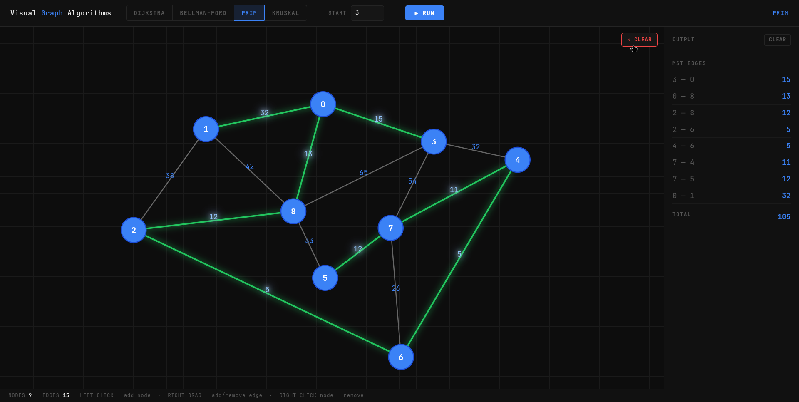

# Visual Graph Algorithms

An interactive graph algorithm visualizer built with Vanilla JS and D3.js.



---


## Algorithms

| Algorithm | Type | Description |
|-----------|------|-------------|
| **Dijkstra** | Shortest Path | Finds the shortest path from a source node to all other nodes |
| **Bellman-Ford** | Shortest Path | Like Dijkstra, but handles graphs with more complex edge structures |
| **Prim** | Minimum Spanning Tree | Builds an MST by greedily adding the cheapest edge from the visited set |
| **Kruskal** | Minimum Spanning Tree | Builds an MST by sorting all edges and adding them without creating cycles |

## Usage

### Building a Graph
- **Left click** on the canvas to add a node
- **Right drag** from one node to another to add an edge (you'll be prompted for a weight)
- **Right drag** between two already-connected nodes to remove the edge
- **Right click** a node to remove it
- **Left drag** a node to reposition it

### Running an Algorithm
1. Select an algorithm from the top bar
2. For Dijkstra, Bellman-Ford, and Prim — enter a start node ID
3. Click **RUN**
4. After the animation completes, click a node in the output panel to highlight its shortest path

> **Note:** Prim and Kruskal require a connected graph.

## Running Locally

Open `index.html` in your browser

OR run:

```bash
python -m http.server 8000
```

Then open `http://localhost:8000` in your browser.


## Stack

- Vanilla JavaScript + D3.js v7
- Bootstrap 5.3
- JetBrains Mono & Inter (Google Fonts)
